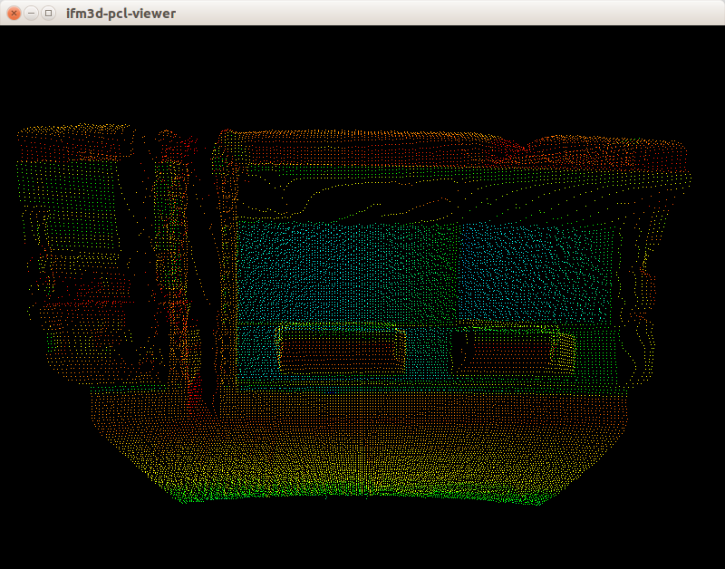

ifm3d-pcl-viewer
================

This project implements a standalone viewer application for
[ifm3d](https://github.com/lovepark/ifm3d). It is built on top of the
visualization framework provided by [PCL](http://pointclouds.org/) and so the
whole PCL visualization stack is a necessary requirement to use this
application. [ROS](http://www.ros.org/) users may prefer to simply use the
facilities of [rviz](http://wiki.ros.org/rviz) via the
[ifm3d-ros](https://github.com/lovepark/ifm3d-ros) package.

Build Dependencies
------------------

To build this software, you must have
[ifm3d](https://github.com/lovepark/ifm3d) installed. Specifically, the
`camera`, `framegrabber`, and `image` modules at version 0.9.0 or better. This
software also requires the [PCL](http://pointclouds.org/) visualization stack
and its dependencies. Version 1.7 or better of PCL should be sufficient.


Linux Build Instructions
------------------------

The software can be built (using `cmake`) and installed (using `dpkg`) as follows:

```
$ mkdir build
$ cd build
$ cmake -DCMAKE_INSTALL_PREFIX=/usr ..
$ make
$ make package
$ make repackage
$ sudo dpkg -i ifm3d-pcl-viewer_0.1.0_amd64.deb
```

Running the Software
--------------------

Assuming you followed the instructions from above for installation, you should
now have `ifm3d-pcl-viewer` installed at `/usr/bin/ifm3d-pcl-viewer`. Running
the executable on the command line, should result in a window similar to the
following:



If your camera is not located at the default IP address of `192.168.0.69`, you
can leverage the `IFM3D_IP` environment variable when running the viewer to
help visualize the point cloud. For example, if your camera is located at
`192.168.1.69`, you would run the exectuable as follows:

```
$ IFM3D_IP=192.168.1.69 ifm3d-pcl-viewer
```

LICENSE
-------
Please see the file called [LICENSE](LICENSE).
